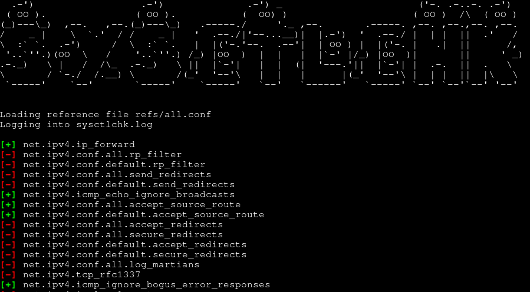

# README

```
Usage: ./sysctlchk.sh [OPTIONS]...
Check sysctl values against a reference file.

Arguments:
  -b print only failed entries
  -f reference file, format is as the 'sysctl -a' output
  -h display this help and exit
  -l log file to output to
  -v verbose mode
```

A simple, POSIX shell script to check sysctl values against a
predefined reference file.

Some reference files are available under refs/, note that these lists
are likely to change and are not exhaustive. You are encouraged to
make your own(s).

Current lists are:

* all.conf (default): hardening settings for network, kernel and
  filesystem that have a reasonable impact on performance and
  operations.
* harder.conf: hardening settings for network, kernel and filesystem that
  either have a big or unknown impact on performances, has not been
  tested yet or is only available on recent kernels.

In time, it is likely that settings from harder.conf migrates to
all.conf.

Note that root permissions are needed to query specific sysctl values
but script will run even as a non-privileged user, displaying "sysctl:
permission denied on key" errors.

Sources for the lists - kudos to all of the authors:

* [Kernel documentation](https://www.kernel.org/doc/Documentation/sysctl/)
* [ANSSI guide for Linux hardening](https://www.kernel.org/doc/Documentation/sysctl/)
* [Arch Linux wiki](https://wiki.archlinux.org/title/Security#Kernel_hardening) and also [here](https://wiki.archlinux.org/title/sysctl#TCP/IP_stack_hardening)

## Examples

Default list, with output log:

```
./sysctlchk.sh -l sysctlchk.log
```



Custom reference file, verbose, only displaying failed checks, with
ouput log:

```
./sysctlchk.sh -l sysctlchk.log -f /some/custom/file.conf -b -v
```


